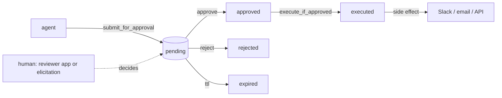

# approvals-mcp

[](https://github.com/larioscow/approvals-mcp/actions/workflows/ci.yml)
[](./LICENSE)

approvals-mcp is an approval gate for AI agents. An agent proposes an action, the action stays pending until a person grants a decision, then the agent runs the side effect at most once. You run it as an MCP server or embed the core as a library.

It is a small monorepo joined by one store: a dependency-free core state machine, an MCP server that exposes the flow as six tools, three resources, and two prompts, a Postgres-backed `DecisionStore`, a reviewer web app, and an example client that drives the loop. The server and the reviewer are two front ends onto the same `ApprovalService`. When both are pointed at one Postgres (`DATABASE_URL`), an action an agent submits over MCP appears in the reviewer, and a decision granted in the reviewer unblocks the agent.

The agent-facing tools expose no approve or reject verb. A decision is granted in one of two places: the reviewer app, or an MCP elicitation prompt the connecting client answers. The reviewer app is a separate surface with no agent access, so approval there does not depend on which client the agent uses. Elicitation is answered by the connecting client, so an autonomous client could answer its own prompt. Rely on the reviewer app as the gate, and treat elicitation as human only when the client is.

---

## How it works



An agent calls `submit_for_approval` (or `request_approval`). The proposal is stored as a `pending` decision. A human approves or rejects it, in the reviewer app or inline through MCP elicitation. Once it is approved, the agent calls `execute_if_approved`, which runs the side effect at most once even under duplicate or concurrent calls. Every transition is written to an append-only audit trail, and can be delivered as a signed webhook.

Each guarded transition (approve, reject, cancel, TTL expiry, and the approved-to-executing claim) goes through one store primitive, `transition(id, expectedStatus, next)`, an atomic compare-and-set that returns the saved decision on a win or `undefined` on a loss. Concurrent callers resolve to one winner and one event. The same property is tested at the in-memory and Postgres layers, including a concurrent-execute race that asserts the executor runs once.

---

## Quick start

```bash
pnpm install
pnpm build
```

Run the whole loop with no database and no keys. The example agent spawns the server over stdio, connects as an MCP client, proposes an action, approves it inline through elicitation, and executes it:

```bash
pnpm --filter @approvals-mcp/example-agent start
```

```
connected to approvals-mcp over stdio
tools: submit_for_approval, request_approval, check_decision, execute_if_approved, cancel_request, list_pending_approvals

agent: proposing a send_message action for approval...
  [reviewer] Approve this send_message? Reply to a new member in #general
  [reviewer] -> approve (a human would decide this)

outcome: {"decision_id":"dec_...","status":"executed","executed":true}
```

Or run the HTTP server and the reviewer side by side:

```bash
pnpm --filter @approvals-mcp/server start     # MCP server on http://localhost:8787/mcp
pnpm --filter @approvals-mcp/reviewer dev      # reviewer on http://localhost:3000
```

By default the server keeps decisions in memory and the reviewer uses an embedded Postgres (PGlite), so they hold separate state. Set `DATABASE_URL` on both to the same Postgres and they share one store.

---

## Using the core on its own

The state machine is a standalone library with no runtime dependencies. Give it a store and your own executors and embed it without the MCP server:

```ts
import { ApprovalService, InMemoryDecisionStore, ExecutorRegistry } from '@approvals-mcp/core';

const service = new ApprovalService({
  store: new InMemoryDecisionStore(),
  executors: new ExecutorRegistry().register({
    kind: 'send_message',
    async execute(payload) {
      // do the real thing here
      return { delivered: true };
    },
  }),
});

const decision = await service.submit({
  action: { kind: 'send_message', summary: 'Reply to a member', payload: { text: 'hi' }, riskTier: 'medium' },
});

await service.approve(decision.id, { reviewer: 'ana' }); // normally a human, out of band
await service.execute(decision.id);                       // runs once
```

A `Decision` carries the proposed `Action`, its `DecisionStatus`, who decided it and why, an optional `ExecutionResult`, and an append-only `AuditEvent[]`. Payloads and outputs are typed `JsonValue` because the store deep-copies them and they can be sent over a webhook. The lifecycle is `pending → approved → executing → executed`, with `rejected`, `cancelled`, `expired`, and a `failed → approved` retry path off the side.

---

## The MCP surface

Built on the Model Context Protocol TypeScript SDK. Six tools, three resources, two prompts, over Streamable HTTP or stdio.

| Tool | Purpose |
|---|---|
| `submit_for_approval` | Queue a proposed action, returns a decision id |
| `request_approval` | Submit and, if the client supports elicitation, ask the human inline |
| `check_decision` | Look up a decision's current status |
| `execute_if_approved` | Run the side effect once, only if approved |
| `cancel_request` | Withdraw a still-pending proposal |
| `list_pending_approvals` | Page through the review queue |

| Resource | Contents |
|---|---|
| `approvals://queue` | The pending review queue |
| `approvals://decision/{id}` | A single decision |
| `approvals://audit/{id}` | A decision's audit trail |

Prompts `summarize_for_review` and `triage_risk` turn an action into a review card or a risk assessment.

The HTTP transport is stateful: each session gets its own `mcp-session-id` and its own short-lived `McpServer`, while all sessions share one `ApprovalService` and one store. The same Express app exposes a health check and a signed-webhook receiver.

---

## Packages

| Package | What it is |
|---|---|
| `@approvals-mcp/core` | The approval state machine, 12 small modules. No runtime dependencies. |
| `@approvals-mcp/server` | The MCP server (tools, resources, prompts, transports, webhooks). Under `packages/mcp-server`. |
| `@approvals-mcp/db` | A Postgres `DecisionStore` built on Drizzle. |
| `@approvals-mcp/reviewer` | The reviewer web app (Next.js), under `apps/reviewer`. Constructed with an empty executor registry, so it holds no credentials and runs no side effects. |
| `@approvals-mcp/example-agent` | An MCP client under `apps/example-agent` that drives the whole loop. |

---

## Configuration

The server reads these from the environment:

| Variable | Used for | Default |
|---|---|---|
| `APPROVALS_TRANSPORT` | `http` or `stdio` | `http` |
| `PORT` | HTTP port | `8787` |
| `APPROVALS_WEBHOOK_SECRET` | Signing outbound and verifying inbound webhooks | `change-me` |
| `APPROVALS_WEBHOOK_URL` | Where to deliver a signed webhook on each transition | unset |
| `DATABASE_URL` | Postgres for the store, shared by the server and reviewer | in-memory |
| `SLACK_WEBHOOK_URL` | Send approved messages to Slack instead of logging them | unset |

Webhook delivery uses an HMAC signature, a per-attempt timeout, bounded exponential backoff, and an idempotency key derived from the decision and transition. Retries cover network errors, 5xx, 429, and 408; other 4xx responses are permanent. The inbound receiver verifies the signature in constant time and dedupes by idempotency key.

---

## Development

```bash
pnpm lint        # Biome
pnpm typecheck   # tsc, strict, exactOptionalPropertyTypes on the libraries (core, db)
pnpm test        # vitest; no network or database (PGlite covers the SQL layer)
pnpm build       # turbo: core/db bundles, the server binary, the reviewer
```

67 tests run with no API keys, no network, and no external database. The core runs entirely on injected I/O (store, clock, executors, sleep) and a fake clock. The MCP layer is tested by connecting a real client over an in-memory transport and exercising tools, resources, prompts, and all three elicitation paths. The store layer runs the real `ApprovalService` against real SQL through PGlite, an in-process Postgres. Biome and tsc pass clean, and CI runs them.

See [ARCHITECTURE.md](./ARCHITECTURE.md) for the design and [RUNBOOK.md](./RUNBOOK.md) for deploying and operating it.

---

## License

MIT
