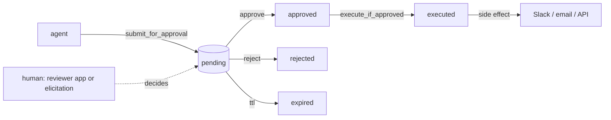

# approvals-mcp

[](https://github.com/larioscow/approvals-mcp/actions/workflows/ci.yml)
[](./LICENSE)

An approval gate for AI agents. An agent proposes an action, a human approves it, then it runs once.

Run it as an MCP server, or embed the core as a library.

---

## Install

```bash
pnpm install
pnpm build
```

---

## Quick start

The whole loop, no database and no keys:

```bash
pnpm --filter @approvals-mcp/example-agent start
```

```
connected to approvals-mcp over stdio
tools: submit_for_approval, request_approval, check_decision, execute_if_approved, cancel_request, list_pending_approvals

agent: proposing a send_message action for approval...
  [reviewer] Approve this send_message? Reply to a new member in #general
  [reviewer] -> approve (a human would decide this)

outcome: {"decision_id":"dec_...","status":"executed","executed":true}
```

The example agent spawns the server over stdio, proposes an action, approves it inline, and runs it.

Run the server and reviewer instead:

```bash
pnpm --filter @approvals-mcp/server start     # MCP server on :8787
pnpm --filter @approvals-mcp/reviewer dev      # reviewer on :3000
```

Set `DATABASE_URL` on both to share one Postgres. Without it the server is in-memory and the reviewer uses an embedded Postgres (PGlite), so they hold separate state.

---

## How it works



An agent calls `submit_for_approval`. The action is stored as `pending`.

A human approves or rejects it, in the reviewer app or through an MCP elicitation prompt. On approval the agent calls `execute_if_approved`, which runs the side effect at most once.

Approval is out of band. The agent-facing tools have no approve or reject verb. The reviewer app is the gate; an elicitation prompt counts as human only when a person answers it.

Every guarded transition is one atomic compare-and-set, so racing approve or execute calls resolve to a single winner. The property is tested over the in-memory store and real Postgres.

Each transition appends to an audit trail and can be delivered as a signed webhook.

---

## Embed the core

The state machine is a standalone library with no runtime dependencies. Give it a store and your executors:

```ts
import { ApprovalService, InMemoryDecisionStore, ExecutorRegistry } from '@approvals-mcp/core';

const service = new ApprovalService({
  store: new InMemoryDecisionStore(),
  executors: new ExecutorRegistry().register({
    kind: 'send_message',
    async execute(payload) {
      // do the real thing here
      return { delivered: true };
    },
  }),
});

const decision = await service.submit({
  action: { kind: 'send_message', summary: 'Reply to a member', payload: { text: 'hi' }, riskTier: 'medium' },
});

await service.approve(decision.id, { reviewer: 'ana' }); // normally a human, out of band
await service.execute(decision.id);                       // runs once
```

A `Decision` holds the `Action`, its status, who decided it, an optional result, and the audit trail. Payloads are `JsonValue`. The lifecycle is `pending → approved → executing → executed`, with `rejected`, `cancelled`, `expired`, and a `failed → approved` retry.

---

## MCP surface

Six tools, three resources, two prompts, over Streamable HTTP or stdio.

| Tool | Purpose |
|---|---|
| `submit_for_approval` | Queue a proposed action, returns a decision id |
| `request_approval` | Submit and, if the client supports elicitation, ask the human inline |
| `check_decision` | Look up a decision's current status |
| `execute_if_approved` | Run the side effect once, only if approved |
| `cancel_request` | Withdraw a still-pending proposal |
| `list_pending_approvals` | Page through the review queue |

| Resource | Contents |
|---|---|
| `approvals://queue` | The pending review queue |
| `approvals://decision/{id}` | A single decision |
| `approvals://audit/{id}` | A decision's audit trail |

Prompts `summarize_for_review` and `triage_risk` turn an action into a review card or a risk assessment.

The HTTP transport is stateful: one `mcp-session-id` per session, all sessions over one `ApprovalService`. The same app serves a health check and a signed-webhook receiver.

---

## Packages

| Package | What it is |
|---|---|
| `@approvals-mcp/core` | The approval state machine, 12 small modules. No runtime dependencies. |
| `@approvals-mcp/server` | The MCP server. Under `packages/mcp-server`. |
| `@approvals-mcp/db` | A Postgres `DecisionStore` on Drizzle. |
| `@approvals-mcp/reviewer` | The reviewer web app (Next.js), under `apps/reviewer`. Holds no credentials and runs no side effects. |
| `@approvals-mcp/example-agent` | An MCP client that drives the loop. |

---

## Configuration

The server reads these from the environment:

| Variable | Used for | Default |
|---|---|---|
| `APPROVALS_TRANSPORT` | `http` or `stdio` | `http` |
| `PORT` | HTTP port | `8787` |
| `APPROVALS_WEBHOOK_SECRET` | Signing outbound and verifying inbound webhooks | `change-me` |
| `APPROVALS_WEBHOOK_URL` | Where to deliver a signed webhook on each transition | unset |
| `DATABASE_URL` | Postgres for the store, shared by the server and reviewer | in-memory |
| `SLACK_WEBHOOK_URL` | Send approved messages to Slack instead of logging them | unset |

Webhook delivery signs the body with HMAC and uses a per-attempt timeout, bounded backoff, and an idempotency key. It retries network errors, 5xx, 429, and 408. The receiver verifies the signature in constant time and dedupes by key.

---

## Development

```bash
pnpm lint        # Biome
pnpm typecheck   # tsc, strict, exactOptionalPropertyTypes on the libraries
pnpm test        # vitest; no network or database
pnpm build       # turbo
```

67 tests run with no API keys, no network, and no external database. The store layer runs the real `ApprovalService` against real SQL through PGlite, an in-process Postgres. Biome and tsc pass, and CI runs them.

See [ARCHITECTURE.md](./ARCHITECTURE.md) for the design and [RUNBOOK.md](./RUNBOOK.md) for operations.

---

## License

MIT
