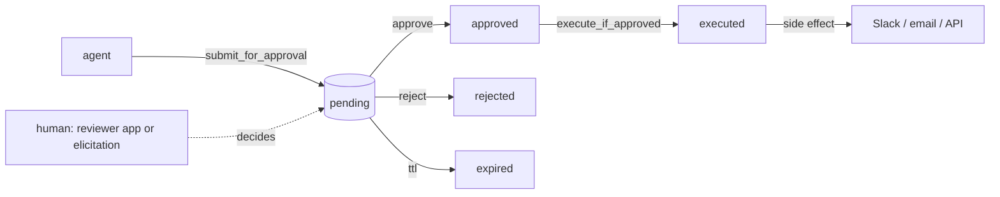

# approvals-mcp

[](https://github.com/larioscow/approvals-mcp/actions/workflows/ci.yml)
[](./LICENSE)

A human-in-the-loop approval layer for AI agents. An agent proposes an action, the action waits until a person approves it, and then it runs exactly once. approvals-mcp ships that flow as an MCP server, a dependency-free core library, a Postgres-backed store, and a reviewer web app.

Most agent tooling sits at one of two extremes: let the model act on its own, or wrap every call in an ad-hoc yes/no prompt. This is the part in between. A durable queue of proposed actions, a real human gate, an audit trail, and at-most-once execution, all reusable across agents and clients.

## How it works



An agent calls `submit_for_approval` (or `request_approval`). The proposal is stored as a `pending` decision. A human approves or rejects it, either in the reviewer app or inline through MCP elicitation. Once it is approved, the agent calls `execute_if_approved`, which runs the side effect at most once even if it is called twice or races with itself. Every transition is written to an append-only audit trail and can be delivered as a signed webhook.

The agent-facing tools expose no approve or reject verb. A decision is granted out of band, in the reviewer app or through an MCP elicitation prompt that the connecting client answers. The reviewer app is a separate surface with no agent access, so it is the gate that holds no matter what client an agent uses. Elicitation is only as human as the client answering it, so do not lean on it as the gate for a fully autonomous client.

## Quick start

```bash
pnpm install
pnpm build
```

Run the server over stdio and drive it with the example agent:

```bash
pnpm --filter @approvals-mcp/example-agent start
```

```
connected to approvals-mcp over stdio
tools: submit_for_approval, request_approval, check_decision, execute_if_approved, cancel_request, list_pending_approvals

agent: proposing a send_message action for approval...
  [reviewer] Approve this send_message? Reply to a new member in #general
  [reviewer] -> approve (a human would decide this)

outcome: {"decision_id":"dec_...","status":"executed","executed":true}
```

Or run the HTTP server and the reviewer app side by side:

```bash
pnpm --filter @approvals-mcp/server start     # MCP server on http://localhost:8787/mcp
pnpm --filter @approvals-mcp/reviewer dev      # reviewer on http://localhost:3000
```

The reviewer reads `DATABASE_URL` (Postgres). Without it, it falls back to an embedded Postgres (PGlite) so you can open the inbox with no setup.

## Using the core on its own

The state machine is a standalone library. You can embed it without the MCP server by giving it a store and your own executors.

```ts
import { ApprovalService, InMemoryDecisionStore, ExecutorRegistry } from '@approvals-mcp/core';

const service = new ApprovalService({
  store: new InMemoryDecisionStore(),
  executors: new ExecutorRegistry().register({
    kind: 'send_message',
    async execute(payload) {
      // do the real thing here
      return { delivered: true };
    },
  }),
});

const decision = await service.submit({
  action: { kind: 'send_message', summary: 'Reply to a member', payload: { text: 'hi' }, riskTier: 'medium' },
});

await service.approve(decision.id, { reviewer: 'ana' }); // normally a human, out of band
await service.execute(decision.id);                       // runs once
```

## The MCP surface

Built on the Model Context Protocol TypeScript SDK. Six tools, three resources, two prompts, over Streamable HTTP or stdio.

| Tool | Purpose |
|---|---|
| `submit_for_approval` | Queue a proposed action, returns a decision id |
| `request_approval` | Submit and, if the client supports elicitation, ask the human inline |
| `check_decision` | Look up a decision's current status |
| `execute_if_approved` | Run the side effect once, only if approved |
| `cancel_request` | Withdraw a still-pending proposal |
| `list_pending_approvals` | Page through the review queue |

| Resource | Contents |
|---|---|
| `approvals://queue` | The pending review queue |
| `approvals://decision/{id}` | A single decision |
| `approvals://audit/{id}` | A decision's audit trail |

Prompts `summarize_for_review` and `triage_risk` turn an action into a review card or a risk assessment.

## Packages

| Package | What it is |
|---|---|
| `@approvals-mcp/core` | The approval state machine. No runtime dependencies. |
| `@approvals-mcp/server` | The MCP server (tools, resources, prompts, transports, webhooks). |
| `@approvals-mcp/db` | A Postgres `DecisionStore` built on Drizzle. |
| `@approvals-mcp/reviewer` | The reviewer web app (Next.js). |
| `apps/example-agent` | A client that runs the whole loop. |

## Configuration

The server reads these from the environment:

| Variable | Used for | Default |
|---|---|---|
| `APPROVALS_TRANSPORT` | `http` or `stdio` | `http` |
| `PORT` | HTTP port | `8787` |
| `APPROVALS_WEBHOOK_SECRET` | Signing outbound and verifying inbound webhooks | `change-me` |
| `APPROVALS_WEBHOOK_URL` | Where to deliver a signed webhook on each transition | unset |
| `DATABASE_URL` | Postgres for the store (server and reviewer share it) | in-memory |
| `SLACK_WEBHOOK_URL` | Send approved messages to Slack instead of logging them | unset |

## Development

```bash
pnpm lint        # Biome
pnpm typecheck   # tsc, strict, exactOptionalPropertyTypes on the libraries
pnpm test        # vitest; no network or database (PGlite covers the SQL layer)
pnpm build       # turbo: core/db bundles, the server binary, the reviewer
```

Tests run with no API keys, no network, and no external database. The store layer is exercised against real SQL through PGlite, an in-process Postgres.

See [ARCHITECTURE.md](./ARCHITECTURE.md) for the design and [RUNBOOK.md](./RUNBOOK.md) for deploying and operating it.

## License

MIT
